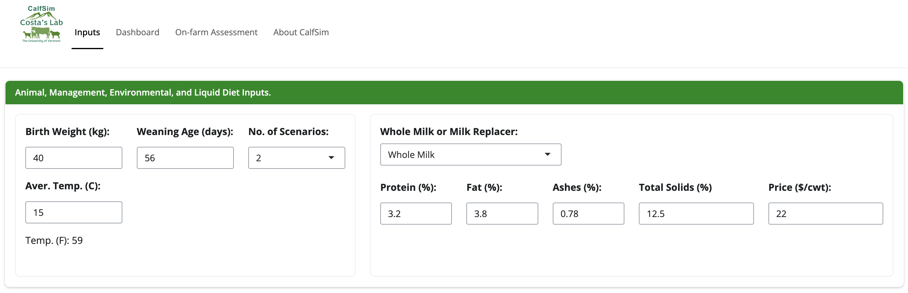
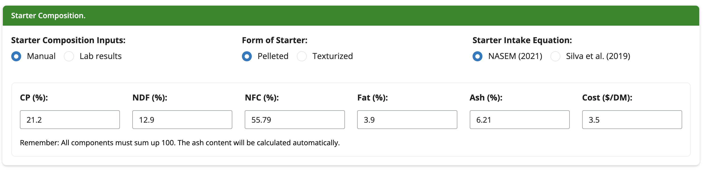
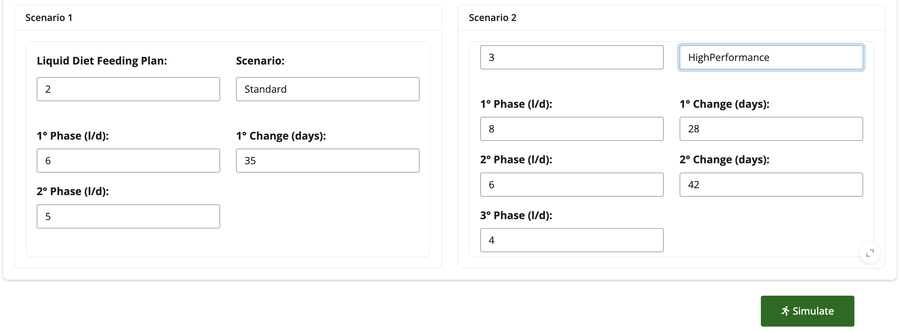
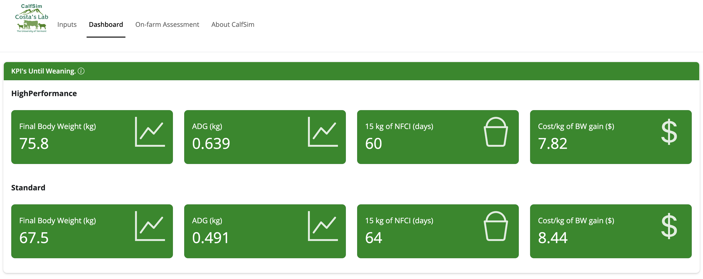
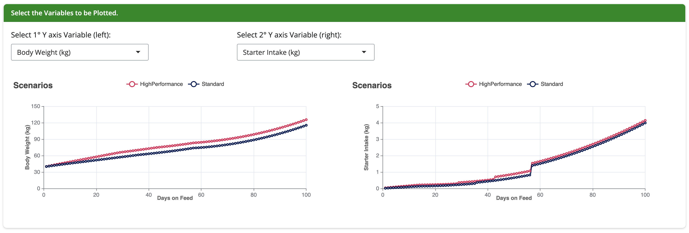

# 1. Introduction

Welcome to the CalfSim Tool, a free and user-friendly resource developed at the University of Vermont-Burlington, Costa Lab, under the leadership of __Dr. Tadeu Eder da Silva__ and __Prof. Dr. Joao Costa__. This tool is designed for consultants and researchers to simulate calf performance under various nutritional plans, with nutritional requirements based on the NASEM (2021) guidelines, adapted for specific research needs.

# 2. Objectives
The purpose of this document is to provide users with the necessary resources to smoothly use the tool and maximize its potential. The functionalities will be demonstrated, along with tips on how to fill in the inputs and analyze the main results.
Still, if you have any questions or potential problems using the CalfSim tool, contact __tadeuederzootecnista@gmail.com__ or __joao.costa@uvm.edu__.

# 3. Features

CalfSim is being developed as a package in R (R Core Team), using the web development framework Shiny. It is a project still under development, therefore, changes may occur over time based on user feedback or as features that we are implementing are added.

## 3.1 Inputs Section

This section, as the name suggests, is where the user enters all the inputs they desire. In addition to the description of the inputs, there is also a screenshot of how the inputs are displayed on the app screen.

### 3.1.1 Animal, Management, Environmental, and Liquid Diet Inputs:

- **Initial Weight (kg):** Enter the initial weight of the calf in kilograms.

- **Weaning Age (days):** Enter the age at which the calf will be weaned in days.

- **Average Environmental Temperature (C):** Enter the average environmental temperature in degrees Celsius.
A small text is shown converting the temperature to Fahrenheit.

- **Number of Scenarios:** Enter the number of scenarios you wish to simulate (1-4). 
Here you simply specify how many scenarios will be simulated; the configuration of the nutritional plans in terms of milk quantities will be defined in the __"Scenarios for Milk Allowance Plans"__ box (last part to fill).

- **Whole Milk or Milk Replacer:** Choose between whole milk or milk replacer.

- **Protein (%):** Enter the protein content of the whole milk or milk replacer in percentage.

- **Fat (%):** Enter the fat content of the whole milk or milk replacer in percentage.

- **Ashes (%):** Enter the ash content of the whole milk or milk replacer in percentage.

- **Dry Matter (DM) (%) or Total Solids (%):** Enter the dry matter content or total solids of the whole milk or milk replacer in percentage.

- **Rep. Dilution:** Enter the dilution factor of the milk replacer.

- **Price ($/DM or $/cwt):** Enter the cost of the whole milk or milk replacer in dollars per dry matter or per hundredweight.

```{r, warning = FALSE, echo = FALSE, error = FALSE, fig.cap="__Figure 1__. _Animal, Management, Environmental, and Liquid Diet Inputs_."}

```

### 3.1.2 Starter Composition:

- **Manual or Lab results:** Choose between manual or lab results. Don't change this, as it is a feature under development.

- **Form of Starter:** Choose between pelleted or texturized.

- **Starter Intake Equation**: Keep NASEM (2001) as the default option. Silva et al. (2021) is a feature under development.

- **Protein (%):** Enter the protein content of the starter concentrate in percentage.

- **NDF (%):** Enter the NDF content of the starter concentrate in percentage.

- **NFC (%):** Enter the NFC content of the starter concentrate in percentage.

- **Fat (%):** Enter the fat content of the starter concentrate in percentage.

- **Ash (%):** Enter the ash content of the starter concentrate in percentage.

- **Cost ($/kg DM):** Enter the cost of the starter concentrate in dollars per kilogram of dry matter.

```{r, warning = FALSE, echo = FALSE, error = FALSE, fig.cap="__Figure 2__. _Starter Composition Inputs_."}

```

### 3.1.3 Scenarios for Milk Allowance Plans

This is a critical part of the application and requires careful attention to fill out in order to avoid any errors. Here, the number of scenarios previously defined will cause fields to appear for filling out. In the example from __Figure 3__, it was determined that 2 scenarios would be evaluated (__Figure 1__).

- **Scenario:** Enter the name of the scenario.

- **Liquid Diet feeding Plan**: Enter the number of changes you want to test in terms of different quantities of milk offered to calves during the weaning period.
As can be seen in __Figure 3__, there are two examples illustrated. The first, called _standard_, has two changes (**6** and **5** l/d, respectively), meaning two feeding plans are tested. In the second scenario (i.e., _HighPerformance_, three scenarios of changes are tested (**8**, **6**, and **4** l/d, respectively). These fields will appear to be filled in as phases in increasing decimal order.

- **1, 2,...Nth change (days)**: Enter the day when the change in the feeding plan will occur.
__Never allow changes to occur on days that exceed the weaning period__ defined at the top of the application. This will cause an error.

```{r, warning = FALSE, echo = FALSE, error = FALSE, fig.cap="__Figure 3__. _Scenarios for Milk Allowance Plans_."}

```

### 3.1.4 Simulate Button

- **Simulate:** After entering all required information, press the **Simulate** button located in the lower right corner of the interface. Immediately upon simulation, you will be redirected to the dashboard page where you can view and analyze the results.

# 4. Outcomes: Data Vizualization and Reporting

## 4.1 Dashboard page

The dashboard page is where the results of the simulation are displayed. The main objective of this page is to provide a visual representation of the data generated by the simulation. The dashboard is divided into three main sections: **Summary**, **Tables**, and **Plots**.

### 4.1.1 KPI's until weaning.

This section shows the main Key Performance Indicators (KPIs) for the calf's performance until weaning. It shows the KPIs of the simulated scenarios side by side:

- **Final Weight (kg):** The final weight of the calf in kilograms.

- **Average Daily Gain (ADG):** The average daily gain of the calf in kilograms per day.

- **15 kg of NFCI (days):** The number of days it took for the calf to reach 15 kg of cumulative Non-Fiber Carbohydrate Intake (NFCI). This number is very relevant, as it projects when (in days) the calf has cumulatively consumed 15 NFC, indicating that the calf TGI is mature enough to digest more complex carbohydrates. For more information, see [Quigley et al. (2019)](https://www.journalofdairyscience.org/article/S0022-0302(19)30082-7/fulltext).

- **Cost of BW gain ($/kg):** The cost of body weight gain in dollars per kilogram.

```{r, warning = FALSE, echo = FALSE, error = FALSE, fig.cap="__Figure 4__. _KPI's untill weaning_."}

```

### 4.1.2. Plots and Scenario Comparison

This section shows the main variables generated by the simulation to be plotted. Here, the user can filter and view the variables up to the first 100 days of the calf's life.

```{r, warning = FALSE, echo = FALSE, error = FALSE, fig.cap="__Figure 5__. _Plots and Scenario Comparison_."}

```

# 5. Costa Lab
Visit the [Costa Lab website](https://costalab.weebly.com/) and 
get to know the team.

